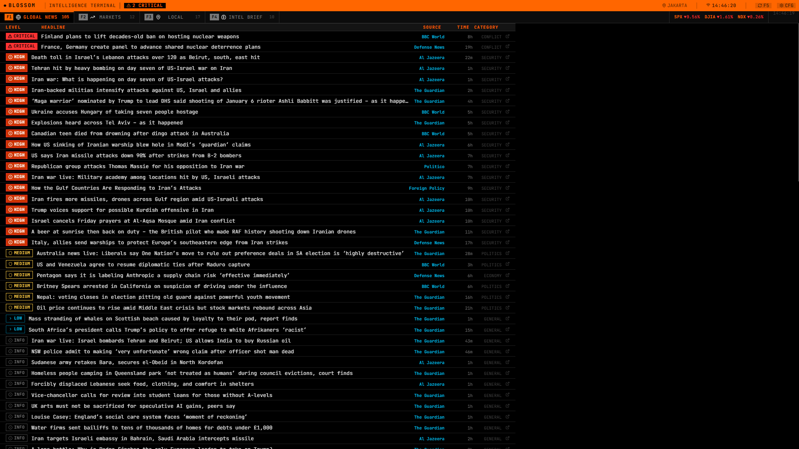

# Blossom Terminal

A Bloomberg-style intelligence terminal for Indonesian equity traders. Aggregates global news, financial markets, local weather, and AI-powered smart money analysis into a single dense terminal interface.



---

## Features

| Tab | Key | Description |
|-----|-----|-------------|
| **Global News** | `F1` | RSS aggregation from Reuters, BBC, Al Jazeera, AP, Guardian, Defense News, Politico, Foreign Policy. Threat-classified (CRITICAL → INFO) and deduplicated. Includes IDX-specific local threat classifier. |
| **Markets** | `F2` | Global and domestic index, equity indices + commodities (Yahoo Finance) |
| **Local** | `F3` | Weather conditions + 7-day forecast (Open-Meteo) + local news for any configured city. |
| **Intel Brief** | `F4` | Claude-powered market pulse: top momentum stocks + sector risk signals derived from latest headlines. |
| **Smart Money** | `F6` | IDX broker flow analysis in two stages: Screener → Deep Dive (see below). |

### Smart Money Screener

Fetches broker accumulation/distribution data from tradersaham.com, runs a **4-gate filter**, pre-scores each stock, then sends the top 10 to Claude for narrative analysis.

**Gate system:**
- **Gate 0** — minimum 2 whale brokers present
- **Gate 1** — whale broker flow ≥ 10% of total accumulation
- **Gate 2** — fewer than 3 of last 5 days are negative flow
- **Gate 3** — distribution flow < 300% of accumulation flow

**Pre-scoring dimensions:** magnitude (rank-based, 40%) · persistence (buy-day consistency, 30%) · price setup (drawdown + VWAP proximity + flow direction, 30%)

**Setup types:** `DIP_BUY` · `PRE_BREAKOUT` · `MOMENTUM_CONTINUATION` · `ACCUMULATION_PHASE`

Claude produces: market pulse, top 5 watchlist with full trade plans (entry zone, stop loss, targets, R/R), and a risk radar of top distribution candidates.

### Deep Dive

Re-analyzes the screener's watchlist using the **broker profiler API** for richer institutional-grade data. Scores each stock across 4 dimensions:

| Dimension | Weight | Source |
|-----------|--------|--------|
| Foreign Conviction | 35% | Foreign smart accumulator count + net dominance |
| Classification Health | 25% | SA/TB vs NS/PT broker ratio |
| Multi-Timeframe Alignment | 25% | Full/10d/5d net value trend + acceleration |
| Claude Signal | 15% | Claude analyzes raw broker data — no pre-computed API signal |

Final combined score = SmartScan × 40% + DeepDive × 60%.

Output includes a **Copy Brief** button that copies a formatted `.md` report (top 5 picks with score breakdown + AI assessment) to clipboard — ready to paste into Claude Code or another AI session.

---

## Tech Stack

| Layer | Technology |
|-------|------------|
| Frontend | React 19 + Vite 7 + TypeScript |
| Backend | Bun + Hono v4 |
| Icons | Lucide React |
| AI | Claude claude-opus-4-7 (via Claude Code CLI) |
| Broker Data | tradersaham.com broker intelligence API |
| Weather | Open-Meteo (free, no key) |
| Markets | Yahoo Finance chart API |

---

## Local Development

### Prerequisites

- [Bun](https://bun.sh) v1.2+
- [Claude Code CLI](https://claude.ai/code) — installed and authenticated (`claude` must be in PATH). Required for Intel Brief, Screener, and Deep Dive.

```bash
# 1. Backend
cd backend
bun install
cp .env.example .env   # edit PORT and FRONTEND_URL if needed
bun run dev            # starts on http://localhost:3001

# 2. Frontend (new terminal)
cd frontend
bun install
bun run dev            # starts on http://localhost:5173
```

Open **http://localhost:5173**

### Backend environment (`backend/.env`)

```env
PORT=3001                              # Optional, default 3001
FRONTEND_URL=http://localhost:5173     # Optional, CORS allowlist
```

No API keys required — AI features use the Claude Code CLI with your local authentication.

---

## Keyboard Shortcuts

| Key | Action |
|-----|--------|
| `F1` | Global News |
| `F2` | Markets |
| `F3` | Local |
| `F4` | Intel Brief |
| `F5` | Force refresh |
| `F6` | Smart Money (Screener + Deep Dive) |

---

## API Endpoints

| Method | Path | Description |
|--------|------|-------------|
| `GET` | `/api/news/global` | Global RSS news (cached 5 min) |
| `GET` | `/api/news/local?city=&country=` | Local news for any city (cached 5 min) |
| `GET` | `/api/markets` | Crypto + indices + commodities + Polymarket (cached 2 min) |
| `GET` | `/api/weather?lat=&lon=&city=` | Weather + 7-day forecast (cached 10 min) |
| `POST` | `/api/intel/brief` | Claude market pulse + momentum stocks + sector risks |
| `POST` | `/api/screener/analyze` | Smart money screener (4-gate filter + Claude analysis) |
| `GET` | `/api/screener/last` | Last screener result from disk cache |
| `POST` | `/api/deepdive/analyze` | Deep dive scoring + Claude signal + markdown brief |
| `GET` | `/api/deepdive/last` | Last deep dive result from disk cache |

---

## Project Structure

```
blossom-terminal/
├── backend/
│   ├── src/
│   │   ├── app.ts                        # Hono app (routes + middleware)
│   │   ├── index.ts                      # Bun local dev entry point
│   │   ├── routes/
│   │   │   ├── news.ts                   # RSS feeds + threat classification
│   │   │   ├── markets.ts                # Crypto, indices, commodities, Polymarket
│   │   │   ├── weather.ts                # Open-Meteo weather
│   │   │   ├── intel.ts                  # Claude Intel Brief
│   │   │   ├── screener.ts               # Smart Money Screener (4-gate + Claude)
│   │   │   └── deepdive.ts               # Deep Dive scoring + Claude signal + .md brief
│   │   └── services/
│   │       ├── cache.ts                  # In-memory TTL cache
│   │       ├── persist.ts                # Disk persistence (last results)
│   │       ├── threatClassifier.ts       # Global news threat keywords
│   │       └── localThreatClassifier.ts  # IDX/Indonesia-specific keywords
│   └── data/                             # Persisted last results (gitignored)
│
├── frontend/
│   ├── src/
│   │   ├── App.tsx                       # Tab layout + keyboard shortcuts
│   │   ├── index.css                     # Bloomberg terminal CSS
│   │   ├── types.ts                      # Shared TypeScript types
│   │   ├── hooks/
│   │   │   ├── useDashboard.ts           # Data fetching + auto-refresh
│   │   │   └── useSettings.ts            # User preferences (localStorage)
│   │   └── components/
│   │       ├── NewsPanel.tsx
│   │       ├── MarketsPanel.tsx
│   │       ├── LocalPanel.tsx
│   │       ├── IntelPanel.tsx
│   │       ├── ScreenerPanel.tsx         # Screener + Deep Dive UI
│   │       └── SettingsModal.tsx
│   └── vite.config.ts
│
├── DEEP_DIVE_INSTRUCTIONS.md             # Deep Dive scoring spec
├── SMART_MONEY_SCREENER.md               # Screener analysis framework spec
└── docs/                                 # Extended documentation
```

---

## Vercel Deployment

The project deploys as **two separate Vercel projects** (backend first, then frontend).

### Step 1 — Deploy Backend

1. Go to [vercel.com/new](https://vercel.com/new) → import repo → set **Root Directory** to `backend`
2. **Framework Preset:** Other
3. **Build command:** `echo done`
4. Add environment variables:

| Variable | Value |
|----------|-------|
| `FRONTEND_URL` | *(leave empty for now, fill after frontend deploys)* |

5. Deploy → note the URL, e.g. `https://blossom-api.vercel.app`

> **Note:** Screener, Deep Dive, and Intel Brief invoke the Claude Code CLI locally. In a Vercel serverless environment these routes require the Claude CLI to be available — consider running the backend on a persistent server (Railway, Fly.io, VPS) if you need these features in production.

### Step 2 — Deploy Frontend

1. Go to [vercel.com/new](https://vercel.com/new) → import same repo → set **Root Directory** to `frontend`
2. **Framework Preset:** Vite (auto-detected)
3. Add environment variables:

| Variable | Value |
|----------|-------|
| `VITE_API_URL` | `https://blossom-api.vercel.app` |

4. Deploy → note the URL, e.g. `https://blossom.vercel.app`

### Step 3 — Connect CORS

Go back to the **backend** project → Settings → Environment Variables:

| Variable | Value |
|----------|-------|
| `FRONTEND_URL` | `https://blossom.vercel.app` |

Redeploy the backend.

---

## Environment Variables Reference

### Backend (`backend/.env`)

| Variable | Required | Description |
|----------|----------|-------------|
| `PORT` | No | Server port. Default: `3001` |
| `FRONTEND_URL` | No | CORS allowlist. Comma-separated URLs. Default: allows all. |

### Frontend (`frontend/.env.local`)

| Variable | Required | Description |
|----------|----------|-------------|
| `VITE_API_URL` | No | Backend base URL. Leave empty in dev (Vite proxy handles it). Set to backend URL in production. |

---

## Data Sources

| Source | Data | Key Required |
|--------|------|--------------|
| Reuters, BBC, AP, Al Jazeera, Guardian, Defense News, Politico, Foreign Policy | Global news RSS | No |
| Google News RSS | Local news by city | No |
| [Yahoo Finance](https://finance.yahoo.com) | Indices + commodities | No |
| [Open-Meteo](https://open-meteo.com) | Weather | No |
| [Claude Code CLI](https://claude.ai/code) | AI analysis (Screener, Deep Dive, Intel) | Auth required |

---

## License

MIT
